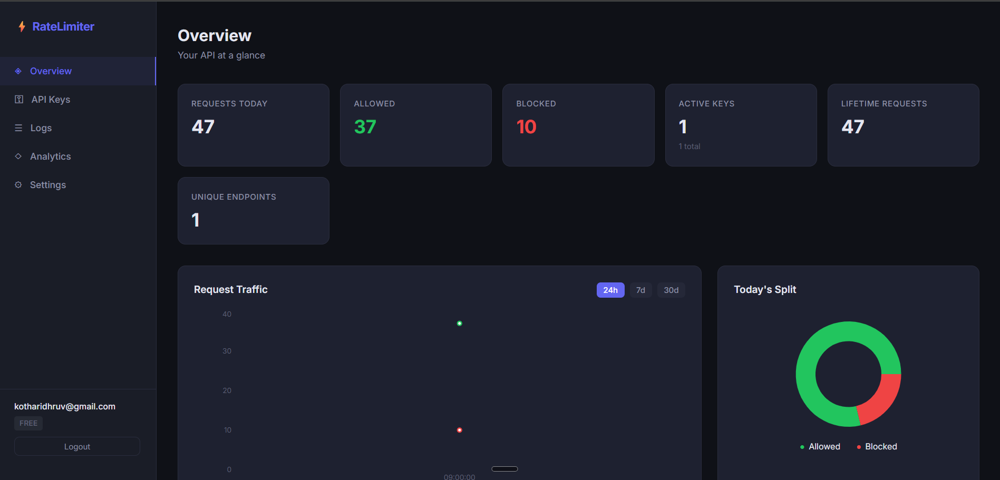
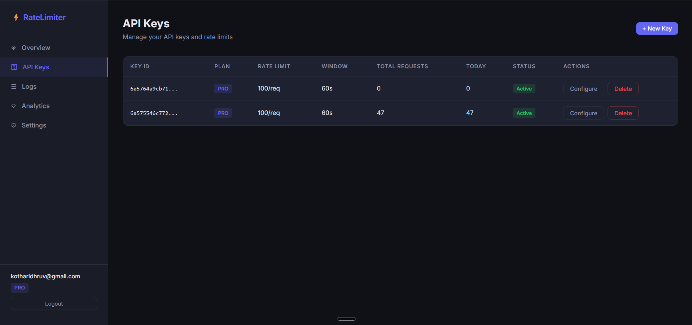
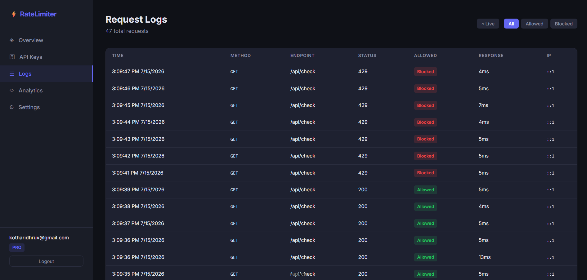
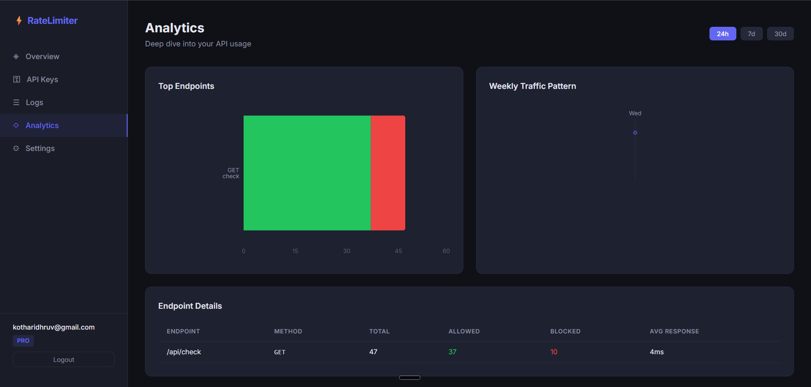
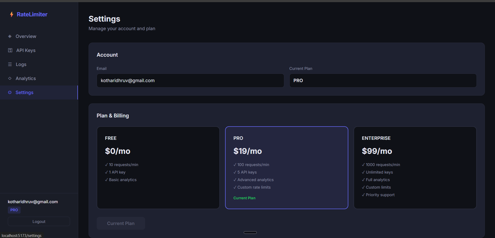
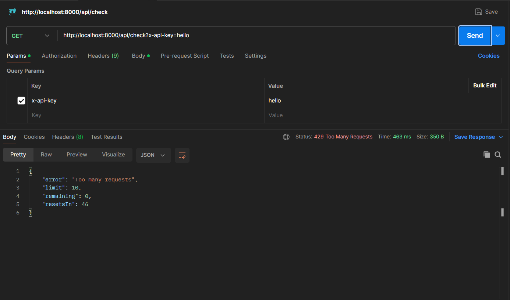

# API Rate Limiter

A scalable backend service built with **Node.js**, **Express.js**, **Redis**, and **MongoDB** that enforces API rate limits to prevent abuse and ensure reliable service availability. The project uses Redis atomic counters and TTL-based expiration to efficiently track requests and throttle clients without introducing database bottlenecks.

## Screenshots

| Overview | API Keys | Logs |
|----------|----------|------|
|  |  |  |

| Analytics | Settings | Rate Limit Response |
|-----------|----------|---------------------|
|  |  |  |

## Features

### Backend
- **Redis-based rate limiting** using atomic counters with configurable TTL windows
- **JWT authentication** with secure token-based session management
- **API key generation** with bcrypt-hashed storage (plaintext keys never persisted)
- **Tiered rate limit plans** (Free, Pro, Enterprise) with per-key customization
- **Request logging** with buffered batch writes and 30-day TTL auto-cleanup
- **Modular middleware pipeline** separating auth, validation, logging, and throttling
- **RESTful API design** with proper HTTP status codes and error handling

### Frontend
- **Interactive dashboard** with real-time usage charts (Recharts)
- **API key management** (create, configure, delete) with inline status indicators
- **Request log viewer** with pagination, filtering, and auto-refresh
- **Analytics page** showing top endpoints and weekly traffic patterns
- **Plan management** with upgrade/downgrade and cascading limit updates
- **Dark theme UI** with responsive layout

## Tech Stack

| Layer | Technologies |
|-------|-------------|
| Runtime | Node.js |
| Framework | Express.js 5 |
| Database | MongoDB (Mongoose ODM) |
| Cache | Redis (ioredis) |
| Auth | JWT, bcrypt |
| Frontend | React 19, React Router 7 |
| Charts | Recharts 3 |
| Build | Vite 8 |

## Architecture

```
┌─────────────────────────────────────────────────────────────┐
│                        Client (React)                       │
│  Login | Register | Overview | Keys | Logs | Analytics      │
└──────────────────────────┬──────────────────────────────────┘
                           │ HTTP (JWT / API Key)
                           ▼
┌─────────────────────────────────────────────────────────────┐
│                   Express.js Server (:8000)                  │
│                                                             │
│  ┌─────────────┐  ┌──────────────┐  ┌───────────────────┐  │
│  │ authMiddleware│  │ apiMiddleware │  │ requestLogger     │  │
│  │ (JWT verify) │  │ (key validate)│  │ (buffered writes) │  │
│  └──────┬──────┘  └──────┬───────┘  └────────┬──────────┘  │
│         │                │                    │              │
│  ┌──────▼────────────────▼────────────────────▼──────────┐  │
│  │                   Controllers                         │  │
│  │  Auth | API Key | Rate Limit | Dashboard              │  │
│  └──────────┬────────────────────────┬───────────────────┘  │
│             │                        │                      │
└─────────────┼────────────────────────┼──────────────────────┘
              │                        │
     ┌────────▼────────┐     ┌─────────▼────────┐
     │     MongoDB      │     │      Redis       │
     │  Users, API Keys │     │  Rate Limit      │
     │  Request Logs    │     │  Counters + TTL  │
     └──────────────────┘     └──────────────────┘
```

## API Endpoints

### Authentication
| Method | Endpoint | Description |
|--------|----------|-------------|
| `POST` | `/auth/register` | Create a new account |
| `POST` | `/auth/login` | Authenticate and receive JWT |

### API Keys
| Method | Endpoint | Auth | Description |
|--------|----------|------|-------------|
| `POST` | `/api/key` | JWT | Generate a new API key |
| `GET` | `/api/check` | API Key | Check rate limit status |

### Dashboard
| Method | Endpoint | Description |
|--------|----------|-------------|
| `GET` | `/dashboard/overview` | Summary statistics |
| `GET` | `/dashboard/usage` | Time-bucketed usage data |
| `GET` | `/dashboard/keys` | List all API keys |
| `PUT` | `/dashboard/keys/:id/config` | Update key rate limits |
| `DELETE` | `/dashboard/keys/:id` | Delete an API key |
| `PUT` | `/dashboard/plan` | Change subscription plan |
| `GET` | `/dashboard/logs` | Paginated request logs |
| `GET` | `/dashboard/top-endpoints` | Top endpoints by volume |
| `GET` | `/dashboard/heatmap` | Weekly traffic heatmap |

## How Rate Limiting Works

1. **Key Validation** - API key from `x-api-key` header is validated against bcrypt hashes in MongoDB
2. **Request Logging** - Request metadata is buffered and batch-written to MongoDB
3. **Redis Counter** - Atomic `INCR` on `rate_limit:{keyId}` with TTL-based window expiration
4. **Enforcement** - Returns `200` with remaining quota or `429` when limit exceeded

### Plan Limits

| Plan | Requests/Window | Window | Max Custom Limit |
|------|----------------|--------|------------------|
| Free | 10 | 60s | 50 |
| Pro | 100 | 60s | 500 |
| Enterprise | 1000 | 60s | 5000 |

## Getting Started

### Prerequisites
- Node.js (v18+)
- MongoDB
- Redis

### Installation

```bash
# Clone the repository
git clone https://github.com/yourusername/API_RATE_LIMITER.git
cd API_RATE_LIMITER

# Install backend dependencies
npm install

# Install frontend dependencies
cd client && npm install && cd ..
```

### Environment Variables

Create a `.env` file in the root directory:

```env
PORT=8000
MONGO_URI=mongodb://localhost:27017/rate_limiter
JWT_SECRET=your_secret_key
REDIS_HOST=127.0.0.1
REDIS_PORT=6379
REDIS_PASS=
CLIENT_URL=http://localhost:5173
```

### Running the Application

```bash
# Start backend (with hot reload)
npm run dev

# Start frontend (in a separate terminal)
npm run client
```

The app will be available at `http://localhost:5173`.

## Project Structure

```
API_RATE_LIMITER/
├── src/                    # Backend source code
│   ├── server.js           # Express app entry point
│   ├── config/             # Redis & plan configuration
│   ├── db/                 # MongoDB connection
│   ├── models/             # Mongoose schemas (User, Api, ApiLog)
│   ├── routes/             # Route definitions
│   ├── controller/         # Business logic handlers
│   └── middleware/          # Auth, API validation, request logging
├── client/                 # React frontend (Vite)
│   └── src/
│       ├── pages/          # Dashboard pages
│       ├── components/     # Reusable UI components
│       ├── context/        # Auth state management
│       └── api/            # Axios configuration
└── .env                    # Environment variables
```

## License

MIT
